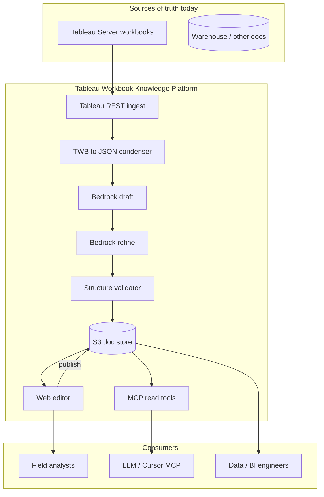
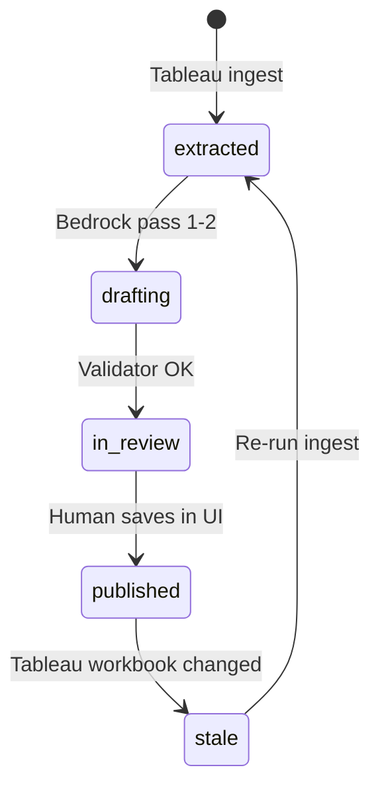

# Architecture

## System context



## Artifact layout (S3)

```text
s3://{bucket}/workbooks/{workbook_id}/
  v{timestamp}/
    metadata.json      # condensed TWB extract
    validation.json    # pass/fail checks
    draft.md           # Bedrock pass 1
    refined.md         # Bedrock pass 2
  published/
    current.md         # human-approved (pointer or copy)
    manifest.json      # version, editor, tableau_updated_at
```

## Two-pass Bedrock design

| Pass | Input | Output | Purpose |
|------|-------|--------|---------|
| 1 Draft | `metadata.json` + prompt template | `draft.md` | Readable narrative for humans |
| 2 Refine | `draft.md` + `metadata.json` | `refined.md` | Fix hallucinations; enforce section template |

Validator runs **after** pass 2 (rule-based, no extra model required for MVP).

## Editorial workflow



## MCP integration (conceptual)

Thin MCP server reads **only** `published/current.md` and manifest:

- No direct Tableau credentials in the agent client.
- Same pattern as governed query MCP: **approved corpus only**.

## Relation to QuickSight migration (separate project)

Shared **only** the ingest + JSON condenser steps. Migration adds:

- Calc translation rules (Tableau → QuickSight expressions)
- Asset deploy (boto3/CDK)
- Visual/layout mapping
- Q topic generation

Do not bundle migration deploy into this repo’s MVP.
